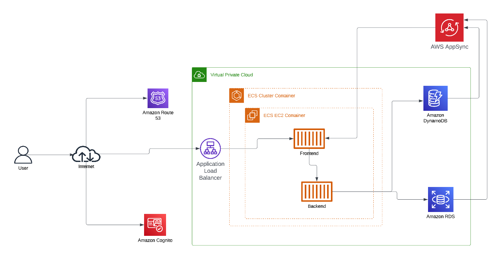

# Week 0 — Billing and Architecture
## My journal - week0

-  Created conceptual diagram

[my-conceptual-diagram](https://lucid.app/lucidchart/62ea08ed-c77d-461d-8269-4f5a23fbeb26/edit?viewport_loc=-3576%2C357%2C2560%2C1216%2C0_0&invitationId=inv_903c46ed-b866-42a8-a04a-a6eb623f9b91 "My conceptual diagram")

-  Created architectural diagram

[my-architectural-diagram](https://lucid.app/lucidchart/34141669-399a-4580-b327-71bb26fa106d/edit?viewport_loc=-666%2C-5%2C2560%2C1216%2C0_0&invitationId=inv_e3086808-3f27-4edd-8499-e386522939d0 "My architectural diagram")

-  Set a billing alarm

-  Set an AWS Budget

-  Generated AWS credentials and used them with AWS CLI

-  Configured AWS CLI also in gitpod

-  Used Cloudshell

-  Created MFA for Root

-  Created Admin IAM user and enabled MFA

