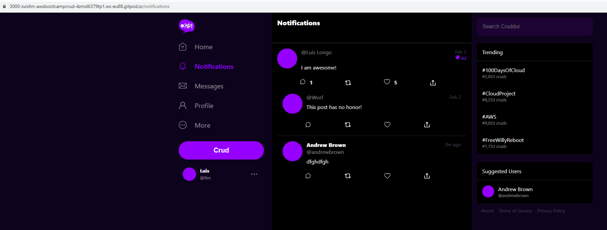
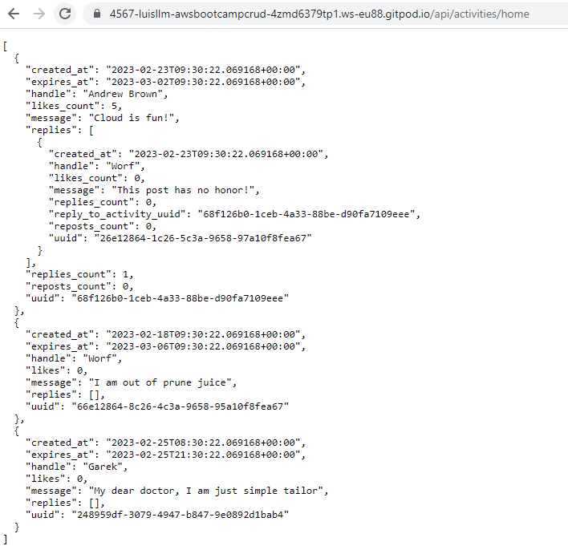
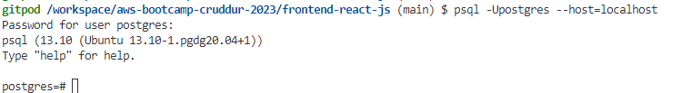
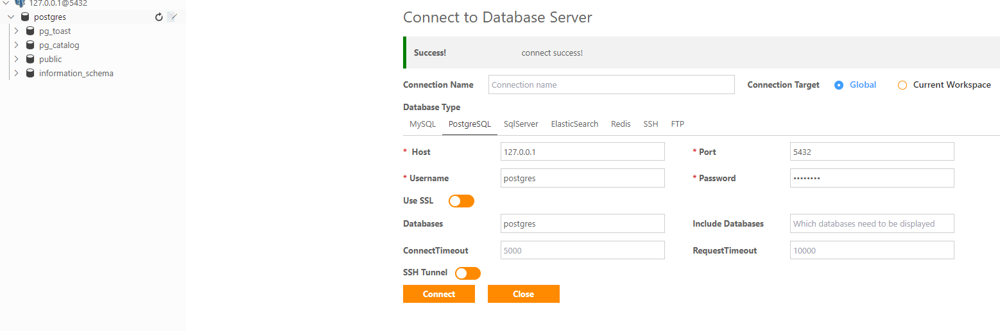
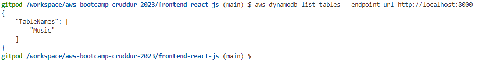
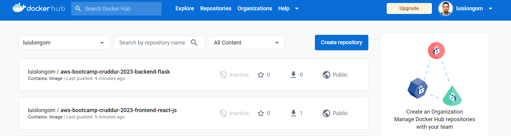
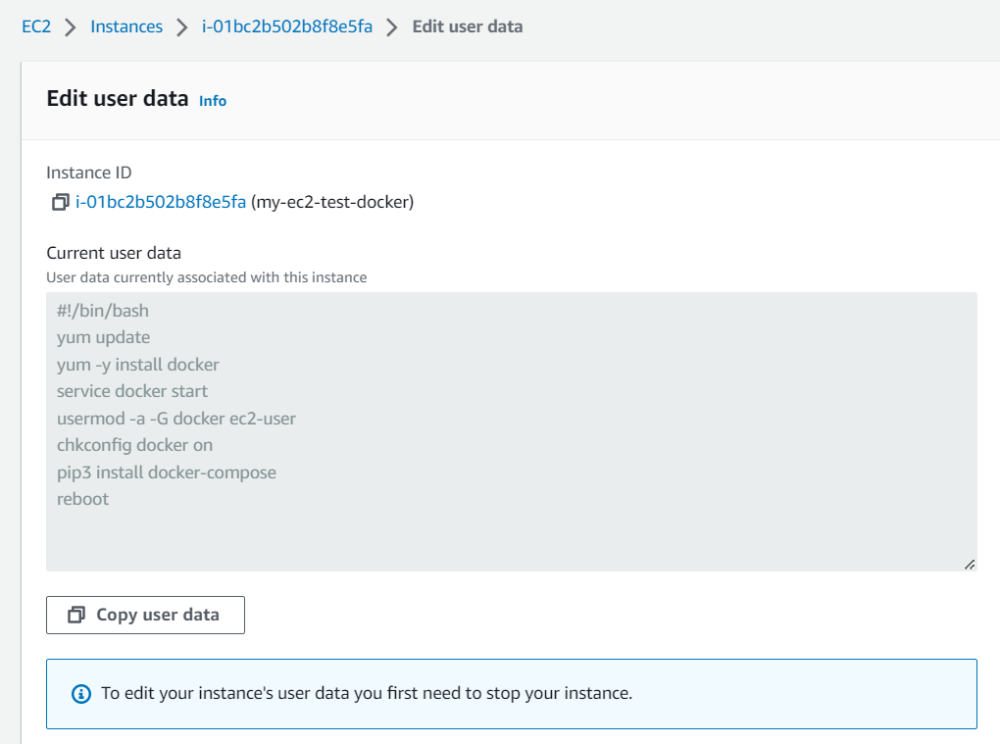

# Week 1 — App Containerization
## My journal - week1

-  **Did all the tasks in the week1 to-do list**












-  **Pushed and tagged the images to DockerHub**




-  **Installed Docker on my local machine, pulled the images and created the containers**

```
vagrant@ubuntu-focal64:~$ docker image ls
REPOSITORY                                                 TAG         IMAGE ID       CREATED        SIZE
luislongom/aws-bootcamp-cruddur-2023-frontend-react-js     1.0         253b333a0fbd   39 hours ago   1.15GB
luislongom/aws-bootcamp-cruddur-2023-backend-flask         1.0         0b1cc8aa9727   39 hours ago   129MB

vagrant@ubuntu-focal64:~/.ssh$ docker ps
CONTAINER ID   IMAGE                                                        COMMAND                  CREATED         STATUS         PORTS                                       NAMES
e022a36ad444   luislongom/aws-bootcamp-cruddur-2023-frontend-react-js:1.0   "docker-entrypoint.s…"   4 seconds ago   Up 2 seconds   0.0.0.0:3000->3000/tcp, :::3000->3000/tcp   ecstatic_ishizaka
ac37df12f718   luislongom/aws-bootcamp-cruddur-2023-backend-flask:1.0       "python3 -m flask ru…"   28 hours ago    Up 28 hours    0.0.0.0:4567->4567/tcp, :::4567->4567/tcp   hungry_archimedes

vagrant@ubuntu-focal64:~/.ssh$ curl -I http://localhost:3000
HTTP/1.1 200 OK
X-Powered-By: Express
Access-Control-Allow-Origin: *
Access-Control-Allow-Methods: *
Access-Control-Allow-Headers: *
Content-Type: text/html; charset=utf-8
Accept-Ranges: bytes
Content-Length: 1278
ETag: W/"4fe-h91iwKBm+7AW8pU/z1UfjllbdRI"
Vary: Accept-Encoding
Date: Sun, 26 Feb 2023 16:04:29 GMT
Connection: keep-alive
Keep-Alive: timeout=5
```


-  **Documented the backend APIs with readme.com**


-  **Implemented a healthcheck in the Docker compose file for the frontend**

```
  frontend-react-js:
    environment:
      REACT_APP_BACKEND_URL: "https://4567-${GITPOD_WORKSPACE_ID}.${GITPOD_WORKSPACE_CLUSTER_HOST}"
    build: ./frontend-react-js
    ports:
      - "3000:3000"
    volumes:
      - ./frontend-react-js:/frontend-react-js
    healthcheck:
      test: curl --fail http://localhost:3000 || exit 1
      interval: 60s
      retries: 5
      start_period: 20s
      timeout: 10s
```


-  **Launched an EC2 instance with docker installed via userdata, pulled the frontend and backend images and run the containers**



```
[ec2-user@ip-172-31-26-76 ~]$ docker image ls
REPOSITORY                                               TAG       IMAGE ID       CREATED      SIZE
luislongom/aws-bootcamp-cruddur-2023-frontend-react-js   1.0       253b333a0fbd   2 days ago   1.15GB
luislongom/aws-bootcamp-cruddur-2023-backend-flask       1.0       0b1cc8aa9727   2 days ago   129MB
curlimages/curl                                          latest    eeb909ee1ed6   6 days ago   15MB

[ec2-user@ip-172-31-26-76 ~]$ docker ps
CONTAINER ID   IMAGE                                                        COMMAND                  CREATED          STATUS          PORTS                                       NAMES
d68812820be3   luislongom/aws-bootcamp-cruddur-2023-backend-flask:1.0       "python3 -m flask ru…"   4 seconds ago    Up 2 seconds    0.0.0.0:4567->4567/tcp, :::4567->4567/tcp   stupefied_bassi
411dbf8b408b   luislongom/aws-bootcamp-cruddur-2023-frontend-react-js:1.0   "docker-entrypoint.s…"   28 seconds ago   Up 26 seconds   0.0.0.0:3000->3000/tcp, :::3000->3000/tcp   brave_cori
```


-  **Run the Dockerfile command as an external script**

```
EXPOSE ${PORT}
RUN chmod +x start-flask.sh
ENTRYPOINT ["./start-flask.sh"]
```

```
#!/bin/bash
python3 -m flask run --host=0.0.0.0 --port=4567
```

