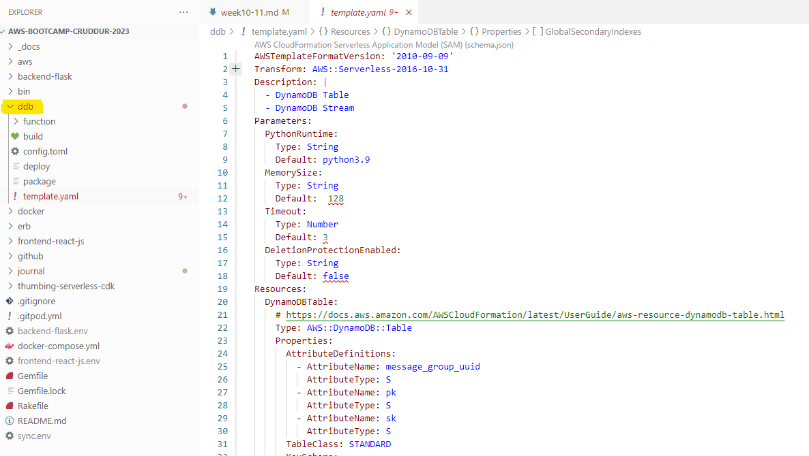

# Week 10-11 — CloudFormation
## My journal - week 10-11

**Did all the tasks in the week10-11 to-do list**
-  **Week10-11 diagrams**	

-  **Implemented CFN Networking Layer, CFN Cluster Layer, CFN Toml, CFN Service Layer for Backend, CFN Database Layer (RDS), CFN Static Website Hosting for Frontend, CI/CD**

-  **DynamoDB using SAM**

