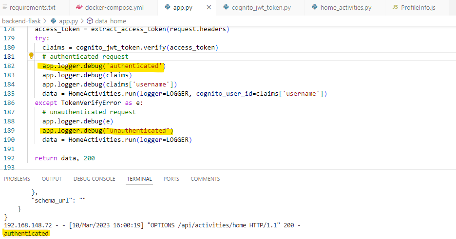

# Week 3 — Decentralized Authentication
## My journal - week3

-  **Did all the tasks in the week3 to-do list**
   -  **Custom Signup page**

 

 


   -  **Custom Confirmation page**

 


   -  **Custom Signin page**

 


   -  **Verified JWT Token server side to serve authenticated API endpoints in Flask Application**

 
In home_activities.py:
 
```
      if cognito_user_id != None:
        extra_crud= {
          'uuid': '248959df-3079-4947-b847-9e0892d1bab4',
          'handle':  'Lore',
          'message': 'This is for auth users only',
          'created_at': (now - timedelta(hours=1)).isoformat(),
          'expires_at': (now + timedelta(hours=12)).isoformat(),
          'likes': 1000,
          'replies': []
        }
        results.insert(0,extra_crud)

      span.set_attribute("app.result_length", len(results))
      return results
```
 
