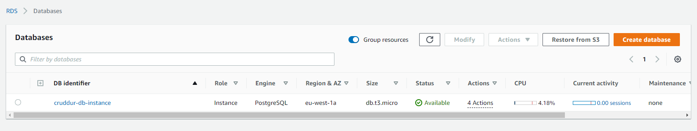
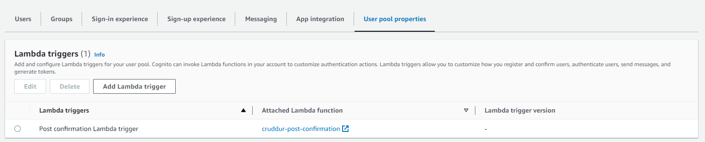

# Week 4 — Postgres and RDS
## My journal - week4

-  **Did all the tasks in the week4 to-do list**
   -  **Created AWS RDS instance**

&nbsp;
&nbsp;
   -  **Created all the bash scripts for all common database actions**
```
gitpod /workspace/aws-bootcamp-cruddur-2023/backend-flask (main) $ ./bin/db-setup 
./bin/db-setup: line 2: -e: command not found
== db-setup
== db-drop
ERROR:  database "cruddur" does not exist
== db-create
CREATE DATABASE
== db-schema-load
/workspace/aws-bootcamp-cruddur-2023/backend-flask/db/schema.sql
not using production
CREATE EXTENSION
NOTICE:  table "users" does not exist, skipping
DROP TABLE
NOTICE:  table "activities" does not exist, skipping
DROP TABLE
CREATE TABLE
CREATE TABLE
== db-seed
/workspace/aws-bootcamp-cruddur-2023/backend-flask/db/seed.sql
not using production
INSERT 0 2
INSERT 0 1
gitpod /workspace/aws-bootcamp-cruddur-2023/backend-flask (main) $ ./bin/db-connect 
psql (13.10 (Ubuntu 13.10-1.pgdg20.04+1))
Type "help" for help.

cruddur=# \dt
           List of relations
 Schema |    Name    | Type  |  Owner   
--------+------------+-------+----------
 public | activities | table | postgres
 public | users      | table | postgres
(2 rows)

cruddur=#
```
   -  **Connected Gitpod to RDS**
```
gitpod /workspace/aws-bootcamp-cruddur-2023/backend-flask (main) $ ./bin/db-connect prod
using production
psql (13.10 (Ubuntu 13.10-1.pgdg20.04+1), server 14.6)
WARNING: psql major version 13, server major version 14.
         Some psql features might not work.
SSL connection (protocol: TLSv1.2, cipher: ECDHE-RSA-AES256-GCM-SHA384, bits: 256, compression: off)
Type "help" for help.

cruddur=> \l
                                      List of databases
   Name    |    Owner    | Encoding |   Collate   |    Ctype    |      Access privileges      
-----------+-------------+----------+-------------+-------------+-----------------------------
 cruddur   | cruddurroot | UTF8     | en_US.UTF-8 | en_US.UTF-8 | 
 postgres  | cruddurroot | UTF8     | en_US.UTF-8 | en_US.UTF-8 | 
 rdsadmin  | rdsadmin    | UTF8     | en_US.UTF-8 | en_US.UTF-8 | rdsadmin=CTc/rdsadmin      +
           |             |          |             |             | rdstopmgr=Tc/rdsadmin
 template0 | rdsadmin    | UTF8     | en_US.UTF-8 | en_US.UTF-8 | =c/rdsadmin                +
           |             |          |             |             | rdsadmin=CTc/rdsadmin
 template1 | cruddurroot | UTF8     | en_US.UTF-8 | en_US.UTF-8 | =c/cruddurroot             +
           |             |          |             |             | cruddurroot=CTc/cruddurroot
(5 rows)
```
   -  **Installed Postgres driver in backend**
```
from lib.db import pool, query_wrap_array

class HomeActivities:
  def run(logger, cognito_user_id=None):
    logger.info("HomeActivities")
    with tracer.start_as_current_span("home-activities-mock-data"):
      span = trace.get_current_span()
      now = datetime.now(timezone.utc).astimezone()
      span.set_attribute("app.now", now.isoformat())

      sql = query_wrap_array("""
      SELECT
        activities.uuid,
        users.display_name,
        users.handle,
        activities.message,
        activities.replies_count,
        activities.reposts_count,
        activities.likes_count,
        activities.reply_to_activity_uuid,
        activities.expires_at,
        activities.created_at
      FROM public.activities
      LEFT JOIN public.users ON users.uuid = activities.user_uuid
      ORDER BY activities.created_at DESC
      """)
      print("SQL-------------------")
      print(sql)
      print("SQL-------------------")

      with pool.connection() as conn:
        with conn.cursor() as cur:
          cur.execute(sql)
          # this will return a tuple
          # the first field being the data
          json = cur.fetchone()
      print("HERE-------------")
      print(json[0])
      return json[0]
```
   -  **Created Cognito Trigger to insert user into database**

&nbsp;
&nbsp;
```
gitpod /workspace/aws-bootcamp-cruddur-2023/backend-flask (main) $ ./bin/db-connect prod
using production
psql (13.10 (Ubuntu 13.10-1.pgdg20.04+1), server 14.6)
WARNING: psql major version 13, server major version 14.
         Some psql features might not work.
SSL connection (protocol: TLSv1.2, cipher: ECDHE-RSA-AES256-GCM-SHA384, bits: 256, compression: off)
Type "help" for help.

cruddur=> select * from users;
                 uuid                 | display_name |   handle    |         email          |           cognito_user_id            |         created_at         
--------------------------------------+--------------+-------------+------------------------+--------------------------------------+----------------------------
 d4db9fe7-3684-4b98-a4af-82410f2cf201 | Andrew Brown | andrewbrown | MOCK                   | MOCK                                 | 2023-03-15 14:31:19.423271
 448e9bde-2a0c-402a-ab31-76cc64f66bb1 | Andrew Bayko | bayko       | MOCK                   | MOCK                                 | 2023-03-15 14:31:19.423271
 1dad0b67-8970-402a-8ea2-529db63a5322 | Luis xxxxx   | xxx         | xxxxxxxxxxxx@gmail.com | 27b4e45c-a5df-4f33-a3c1-76da8dce3a9b | 2023-03-15 14:51:39.65371
(3 rows)
```
   -  **Created new activities with a database insert**

&nbsp;
&nbsp;