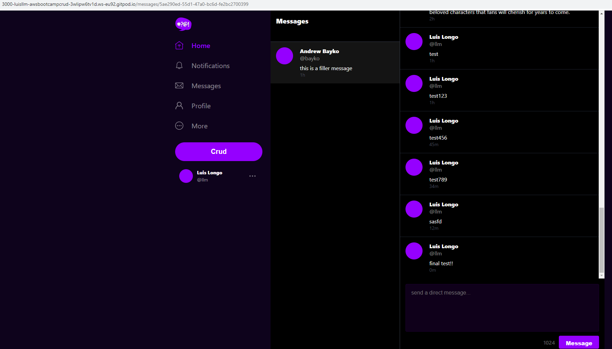
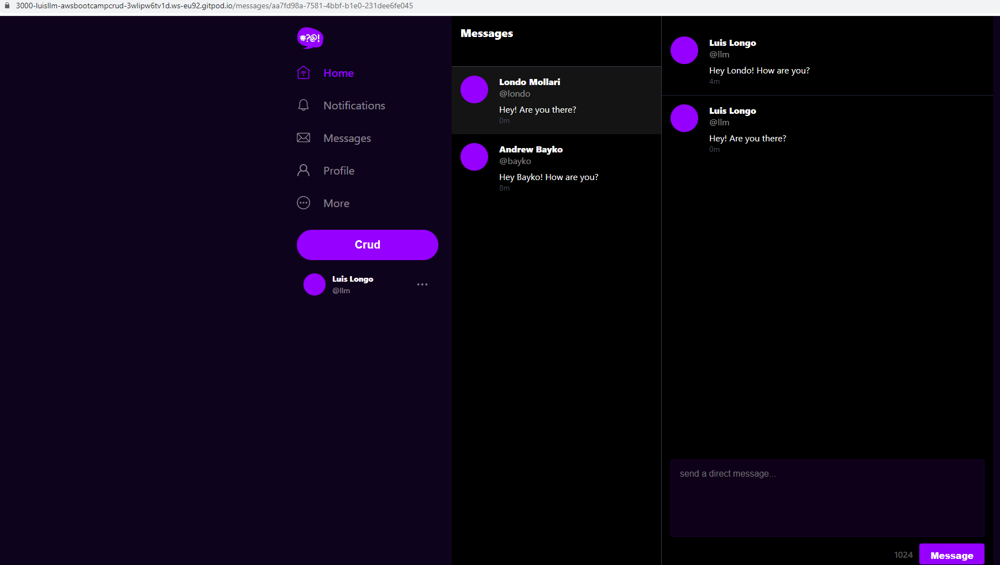
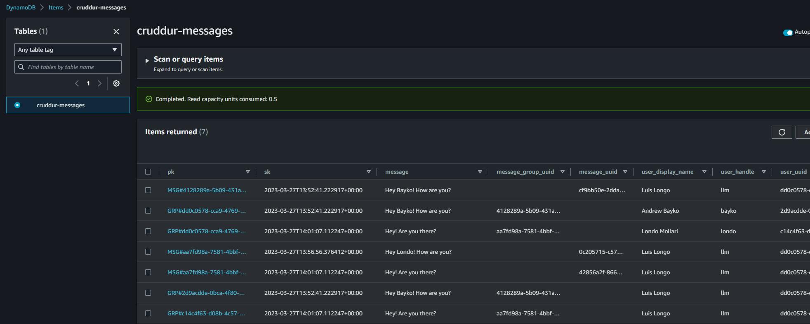

# Week 5 — DynamoDB and Serverless Caching
## My journal - week5

**Did all the tasks in the week5 to-do list**
-  **Implemented scripts for DynamoDB and implemented all the patterns into the application**

&nbsp;
&nbsp;

-  **Implemented (pattern E) updating a message group using DynamoDB streams**

&nbsp;
&nbsp;

