# Week 6 & 7 — Deploying Containers
## My journal - week 6 & 7 

**Did all the tasks in the week6&7 to-do list**
-  **Provisioned ECS Cluster**	
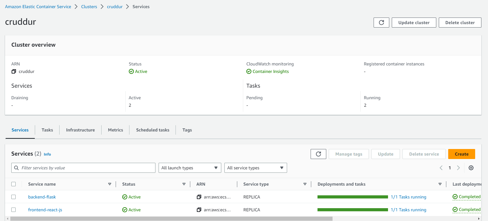

-  **Created ECR repo and pushed image for backend-flask and fronted-react-js**
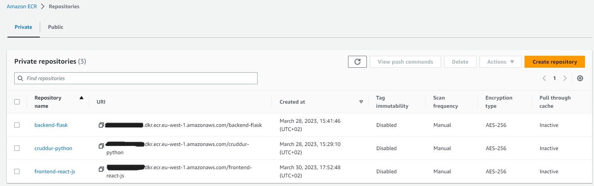

-  **Deployed Backend Flask and Frontend React JS apps as a service to Fargate**
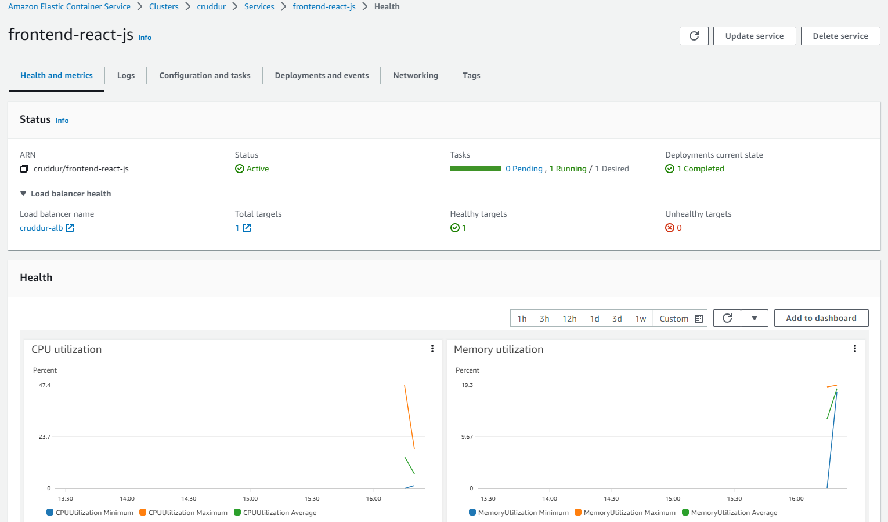
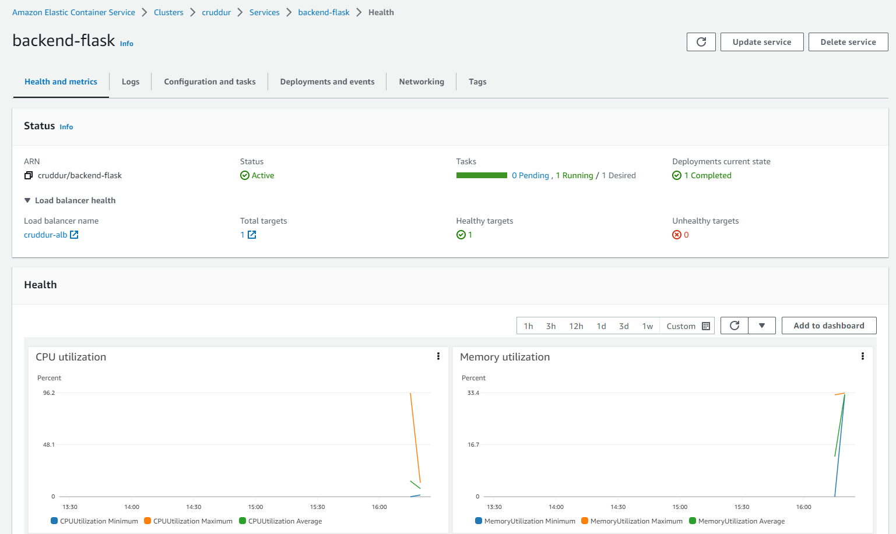
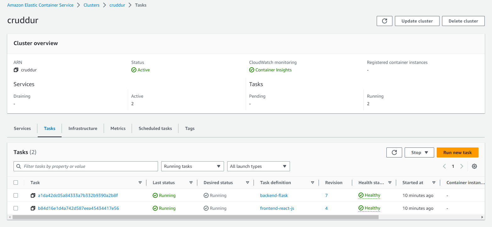

-  **Provisioned and configure Application Load Balancer along with target groups**
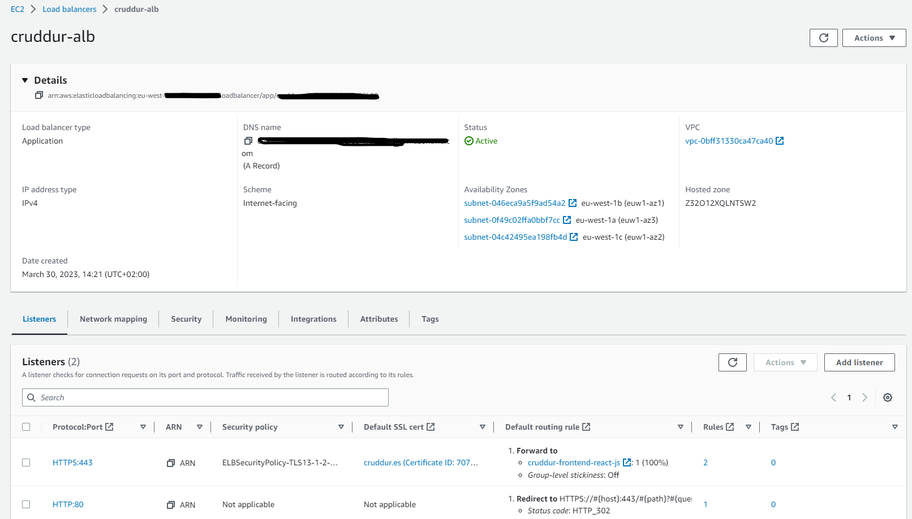
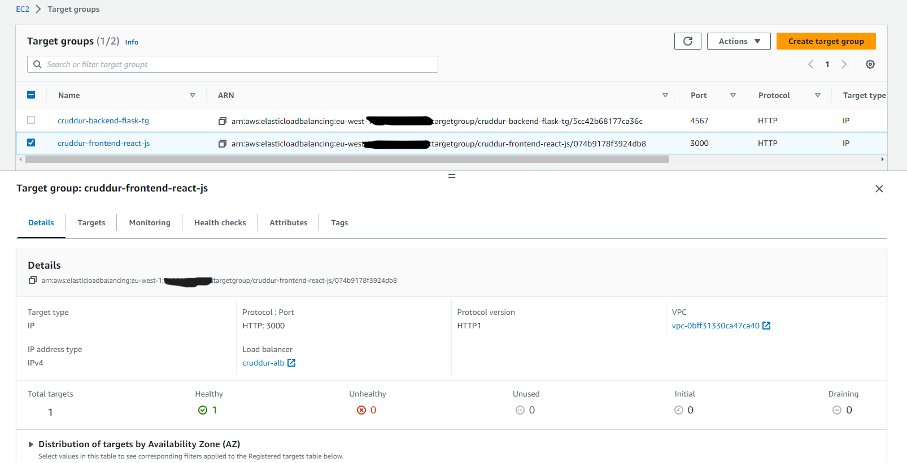
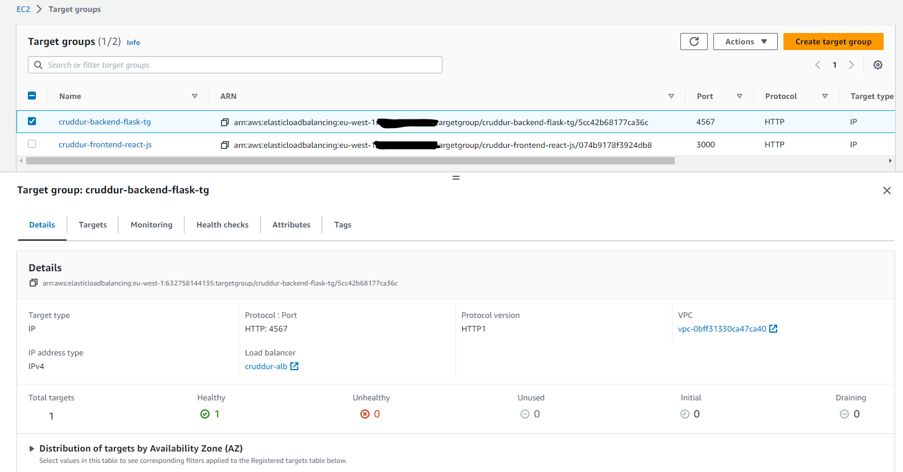

-  **Created an SSL cerificate via ACM**
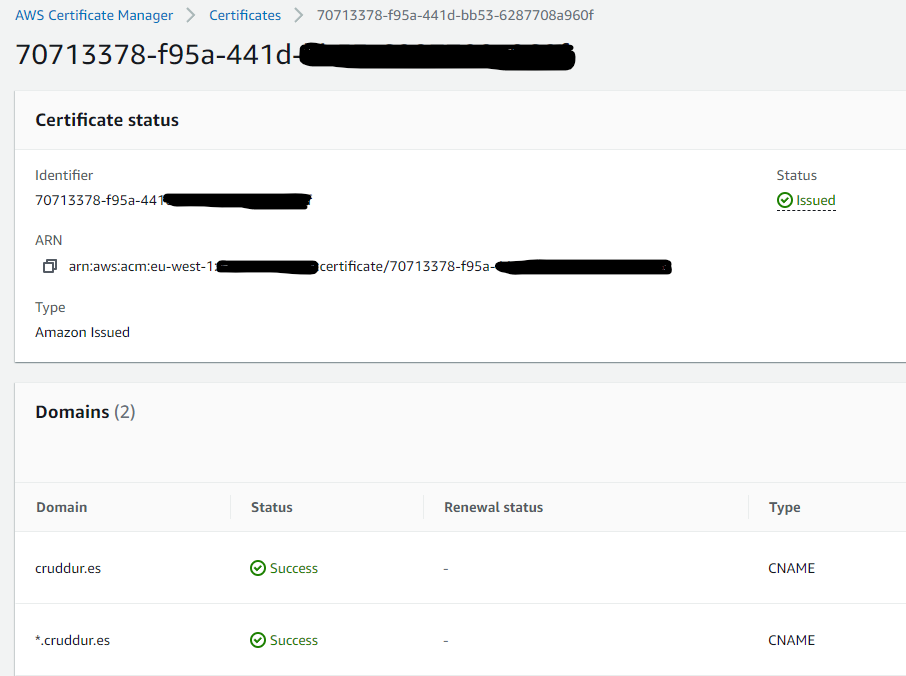

-  **Managed domain using Route53 via hosted zone & Setup a record set for naked domain to point to frontend-react-js & Setup a record set for api subdomain to point to the backend-flask & Configured CORS to only permit traffic from our domain**
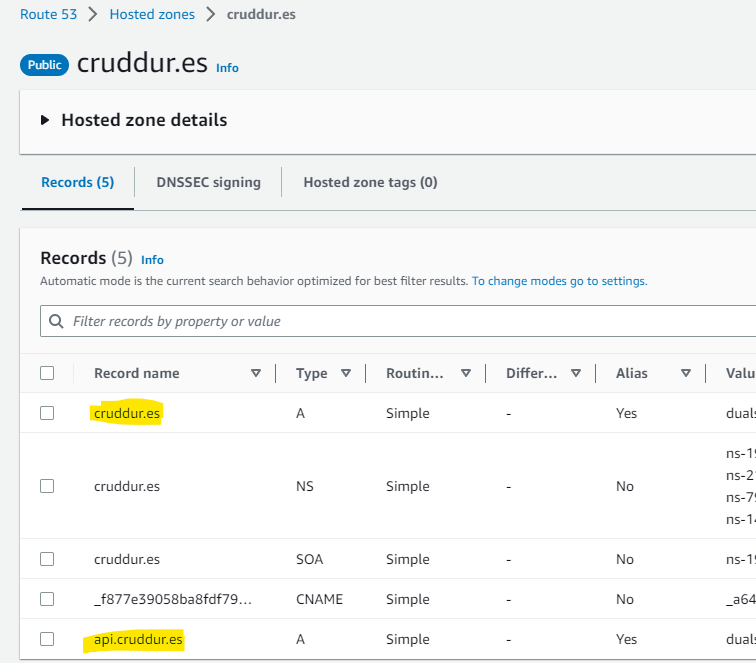
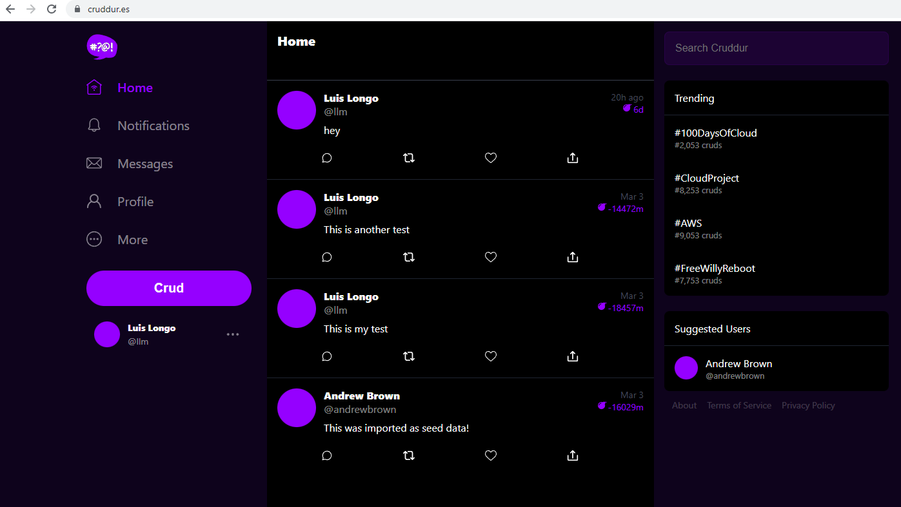
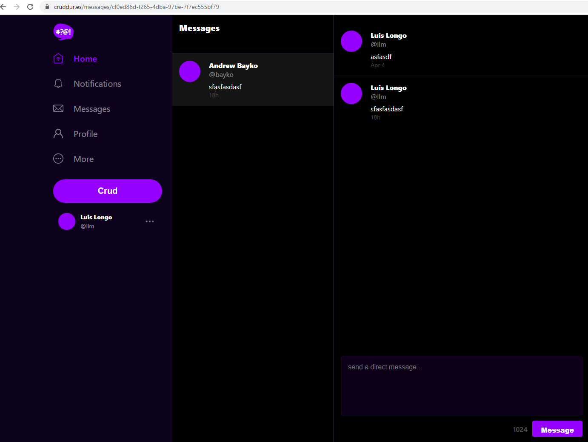

-  **Secured Flask by not running in debug mode for prod & Created Dockerfile specfically for production use case**

For the backend:
```
FROM 632758144135.dkr.ecr.eu-west-1.amazonaws.com/cruddur-python:3.10-slim-buster
#test with gitpod
#FROM python:3.10-slim-buster

#For debugging, don't leave in prod
#RUN apt-get update -y
#RUN apt-get install iputils-ping -y

WORKDIR /backend-flask

COPY requirements.txt requirements.txt
RUN pip3 install -r requirements.txt

COPY . .

EXPOSE ${PORT}

CMD [ "python3", "-m" , "flask", "run", "--host=0.0.0.0", "--port=4567", "--no-debug", "--no-debugger", "--no-reload"]
#RUN chmod +x start-flask.sh
#ENTRYPOINT ["./start-flask.sh"]
```

For the frontend:
```
# Base Image ~~~~~~~~~~~~~~~~~~~~~~~~~~~~~~~~~~
FROM node:16.18 AS build

ARG REACT_APP_BACKEND_URL
ARG REACT_APP_AWS_PROJECT_REGION
ARG REACT_APP_AWS_COGNITO_REGION
ARG REACT_APP_AWS_USER_POOLS_ID
ARG REACT_APP_CLIENT_ID

ENV REACT_APP_BACKEND_URL=$REACT_APP_BACKEND_URL
ENV REACT_APP_AWS_PROJECT_REGION=$REACT_APP_AWS_PROJECT_REGION
ENV REACT_APP_AWS_COGNITO_REGION=$REACT_APP_AWS_COGNITO_REGION
ENV REACT_APP_AWS_USER_POOLS_ID=$REACT_APP_AWS_USER_POOLS_ID
ENV REACT_APP_CLIENT_ID=$REACT_APP_CLIENT_ID

COPY . ./frontend-react-js
WORKDIR /frontend-react-js
RUN npm install
RUN npm run build

# New Base Image ~~~~~~~~~~~~~~~~~~~~~~~~~~~~~~
FROM nginx:1.23.3-alpine

# --from build is coming from the Base Image
COPY --from=build /frontend-react-js/build /usr/share/nginx/html
COPY --from=build /frontend-react-js/nginx.conf /etc/nginx/nginx.conf

EXPOSE 3000
```

-  **Implemented Refresh Token for Amazon Cognito**
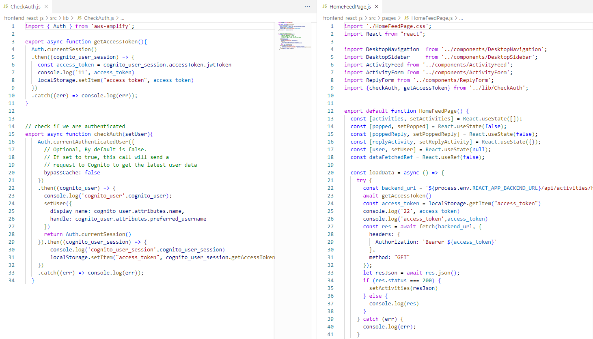

-  **Refactored bin directory to be top level**

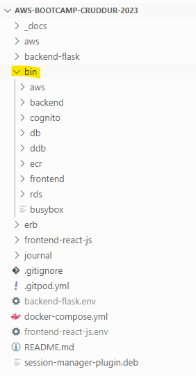
  
-  **Configured task definitions to contain x-ray**
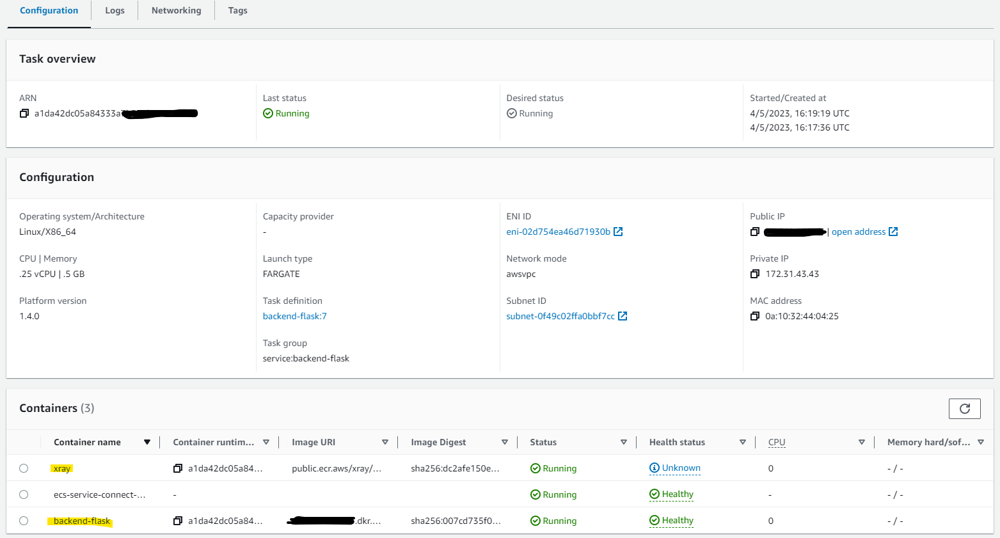

-  **Turned on Container Insights**
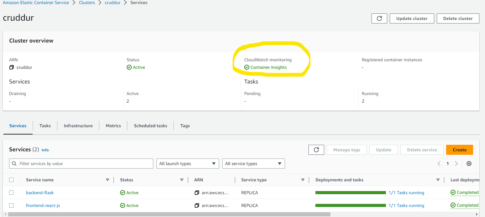

-  **Changed Docker Compose to explicitly use a user-defined network**

In docker-compose.yml
```
services:
  backend-flask:
    env_file:
      - backend-flask.env
    build: ./backend-flask
    ports:
      - "4567:4567"
    volumes:
      - ./backend-flask:/backend-flask
    networks:
      - cruddur-net

[***]

networks: 
  cruddur-net:
    driver: bridge
    name: cruddur-net
```

-  **Used ruby generate out env dot files for docker using erb templates**
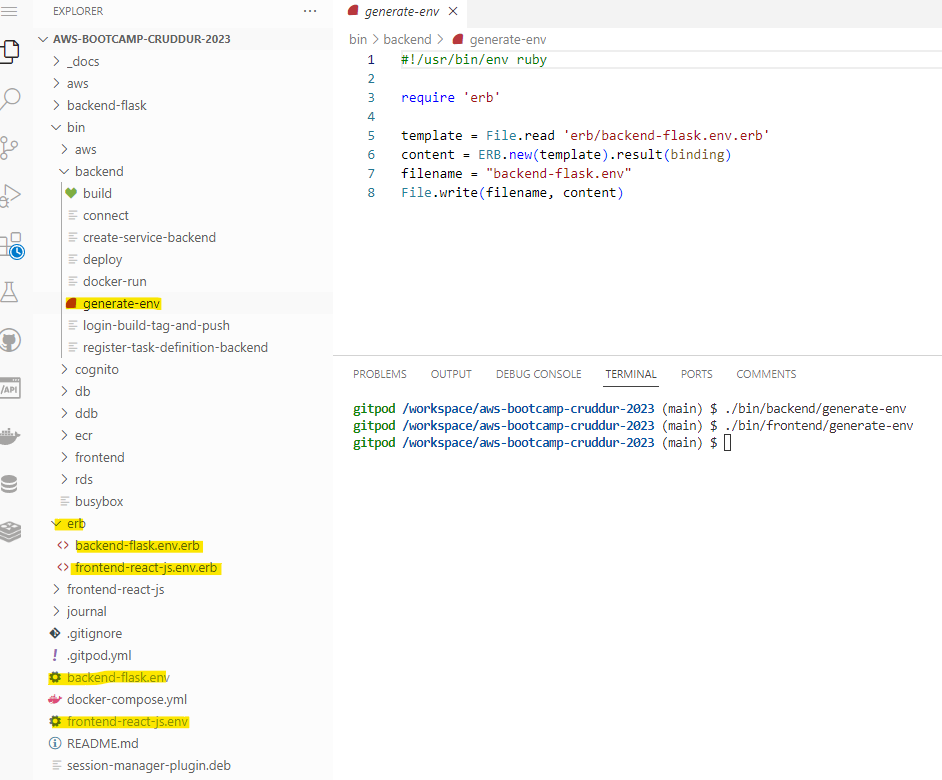