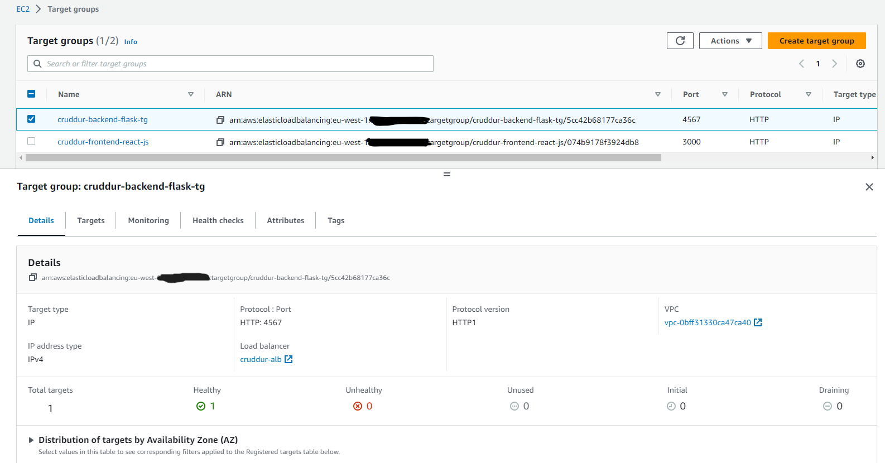

# Week 6 & 7 — Deploying Containers
## My journal - week 6 & 7 

**Did all the tasks in the week6&7 to-do list**
-  **Provisioned ECS Cluster**	

-  **Created ECR repo and pushed image for backend-flask and fronted-react-js**

-  **Deployed Backend Flask and Frontend React JS apps as a service to Fargate**

-  **Provisioned and configure Application Load Balancer along with target groups**

-  **Created an SSL cerificate via ACM**

-  **Managed domain using Route53 via hosted zone & Setup a record set for naked domain to point to frontend-react-js & Setup a record set for api subdomain to point to the backend-flask & Configured CORS to only permit traffic from our domain**

