# Week 8 — Serverless Image Processing
## My journal - week 8

**Did all the tasks in the week8 to-do list**
-  **Week8 architecture diagram**	
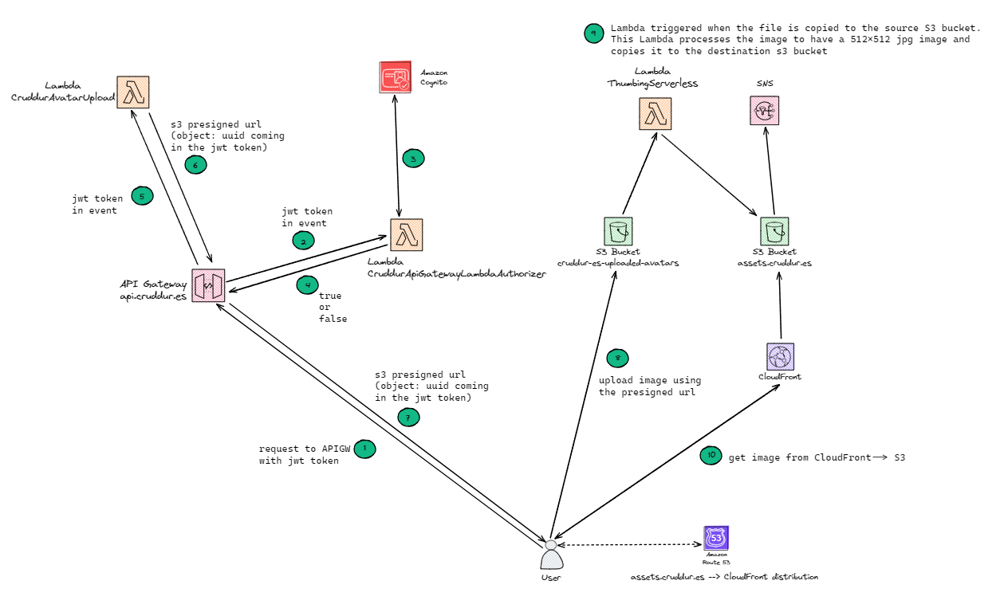

-  **Implemented CDK Stack**	
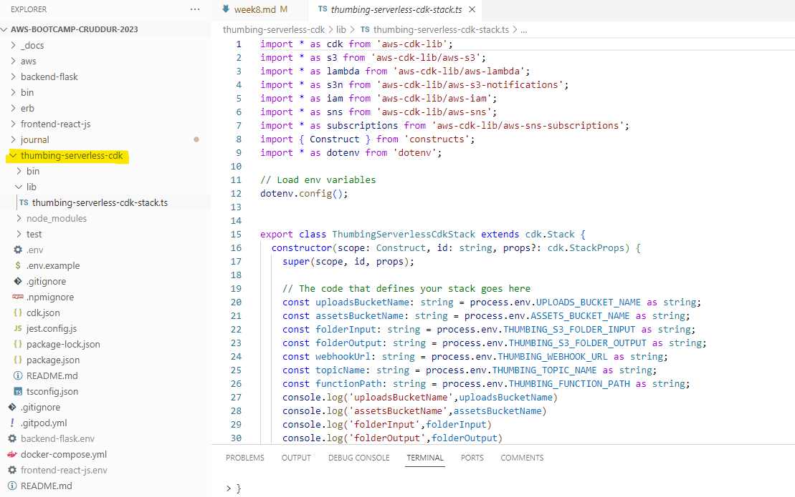
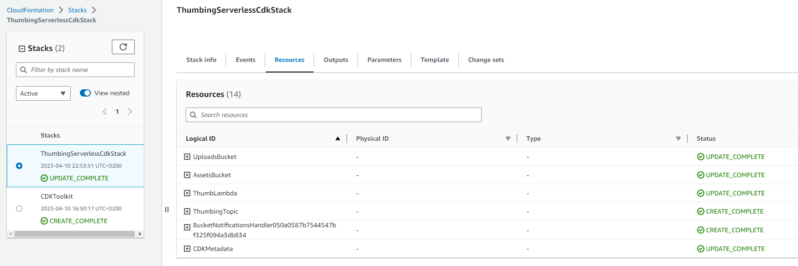

-  **Served Avatars via CloudFront**
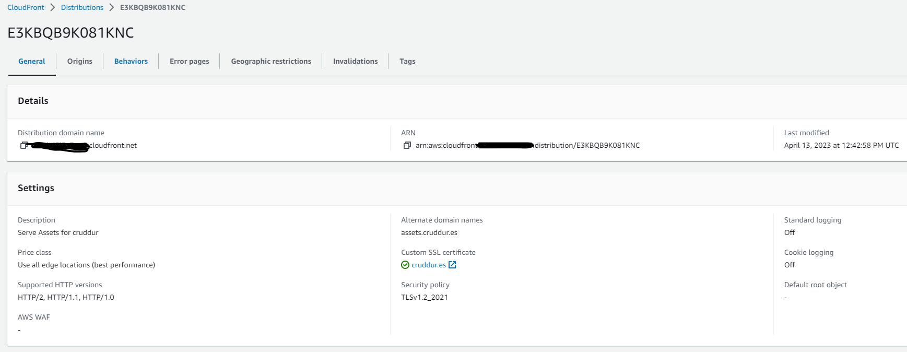
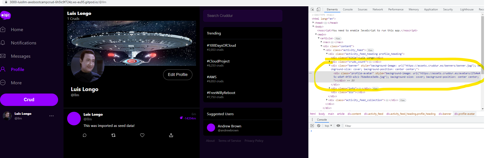

-  **Implemented Users Profile Page**
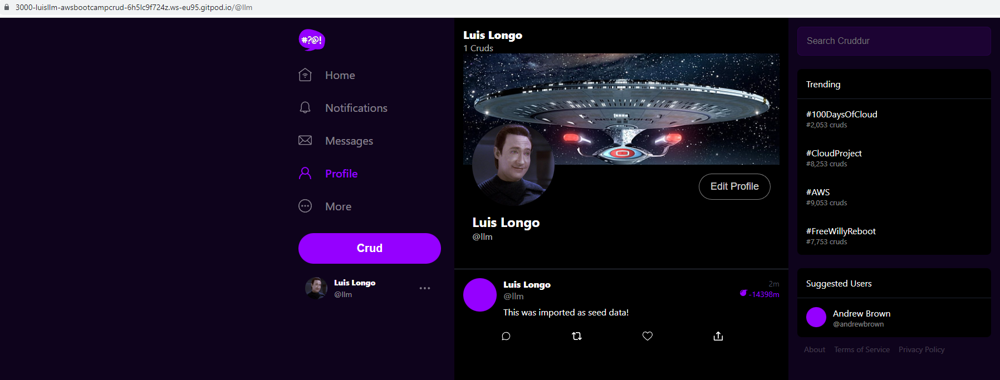

-  **Implemented Users Profile Form**
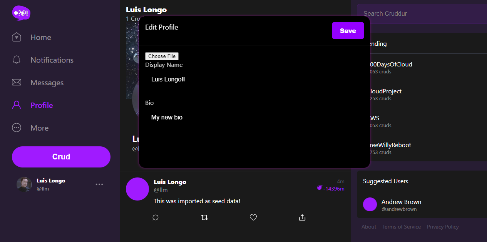

-  **Implemented Backend Migrations**
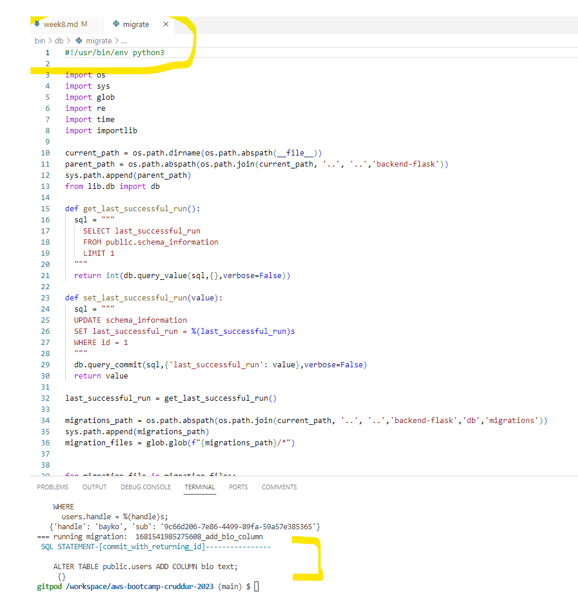

-  **Generated Presigned URL via Ruby Lambda**
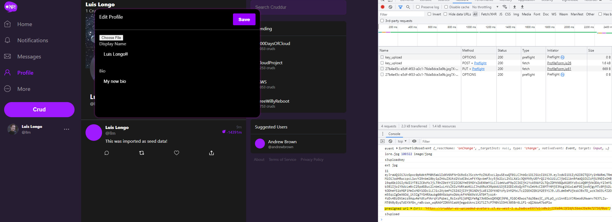

-  **Implemented HTTP API Gateway with Lambda Authorizer**
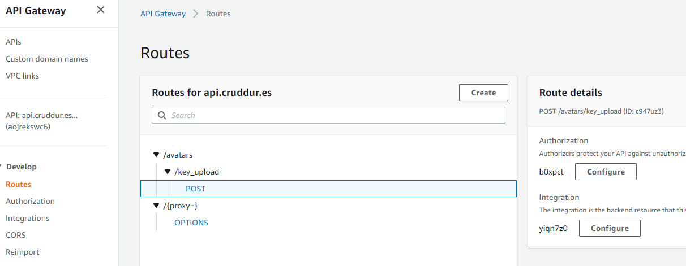
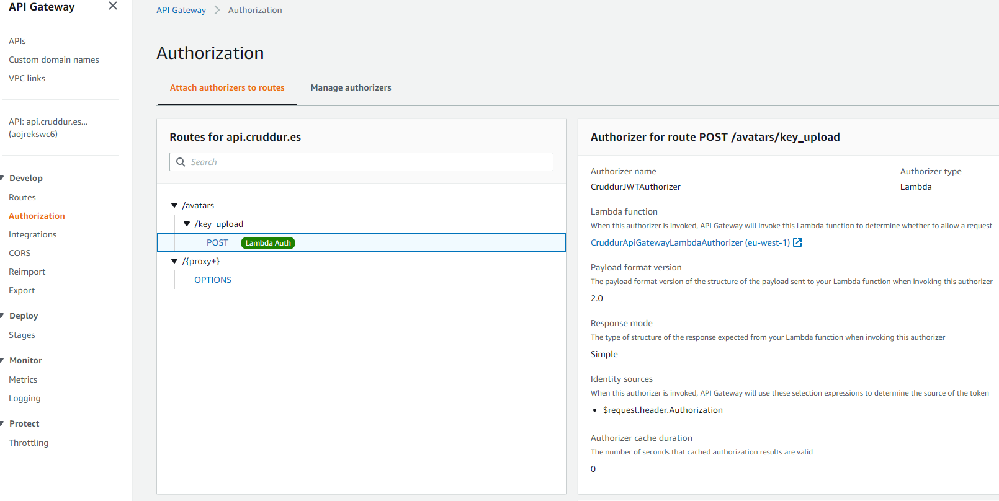
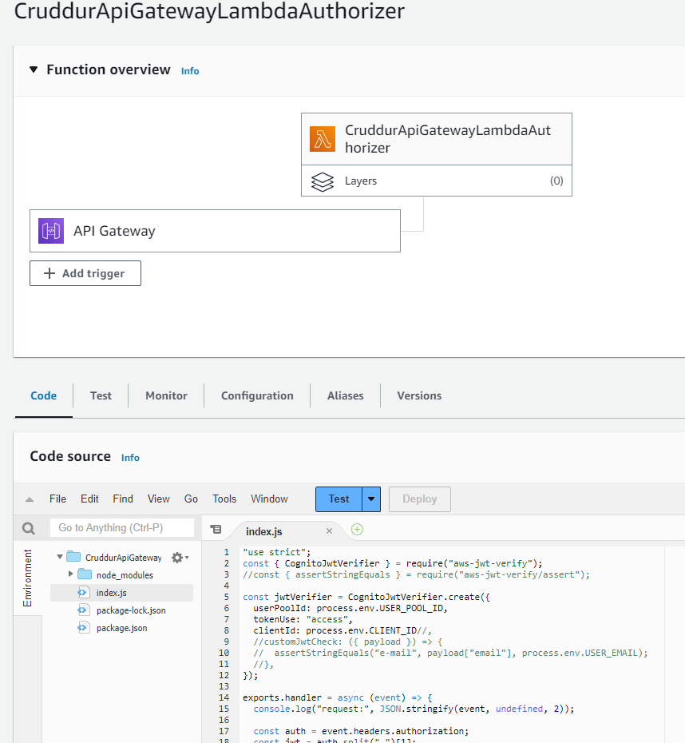

-  **Created JWT Lambda Layer**
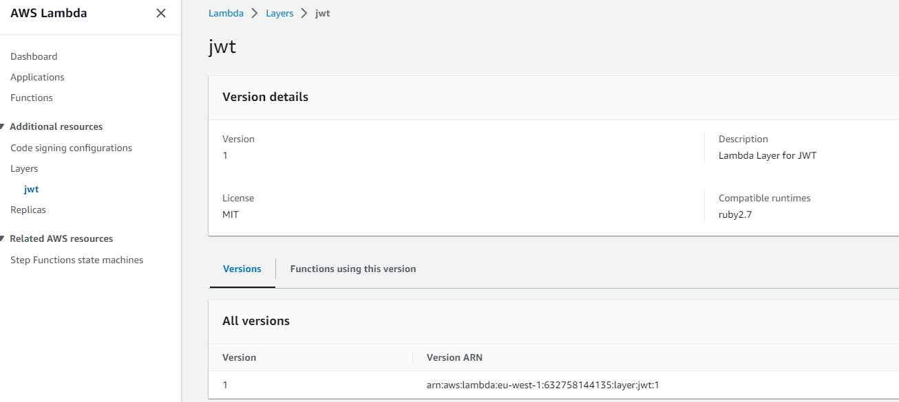

-  **Rendered Avatars in App via CloudFront**
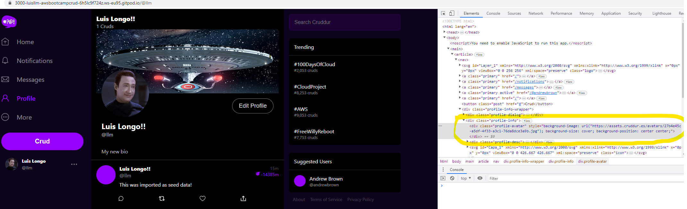