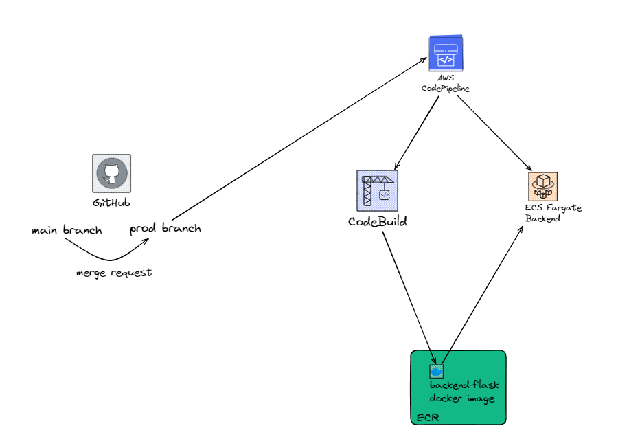
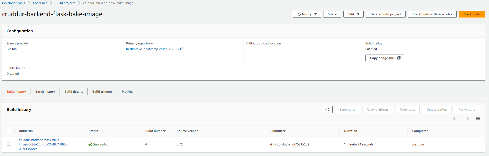
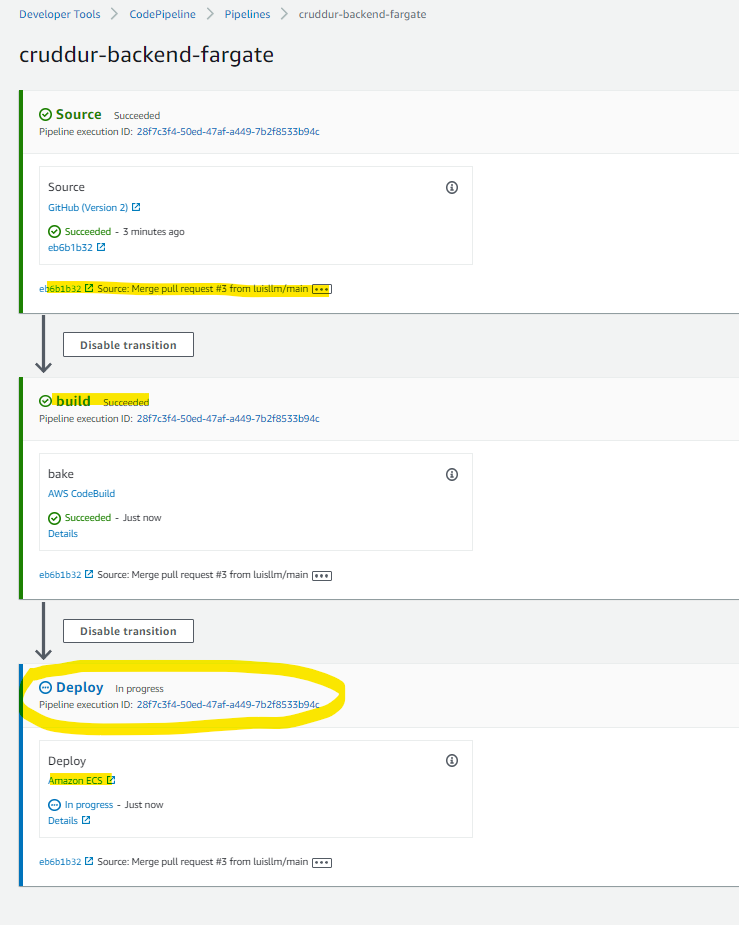
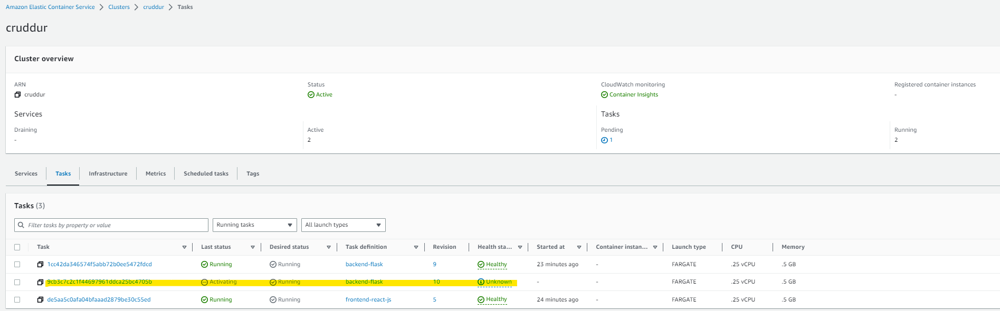

# Week 9 — CI/CD with CodePipeline, CodeBuild and CodeDeploy
## My journal - week 9

**Did all the tasks in the week8 to-do list**
-  **Week9 architecture diagram**	

-  **Configured CodeBuild**

-  **Configured CodePipeline**

