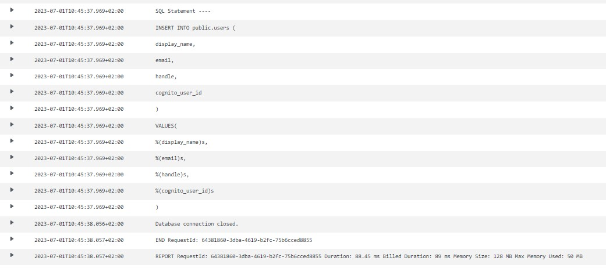
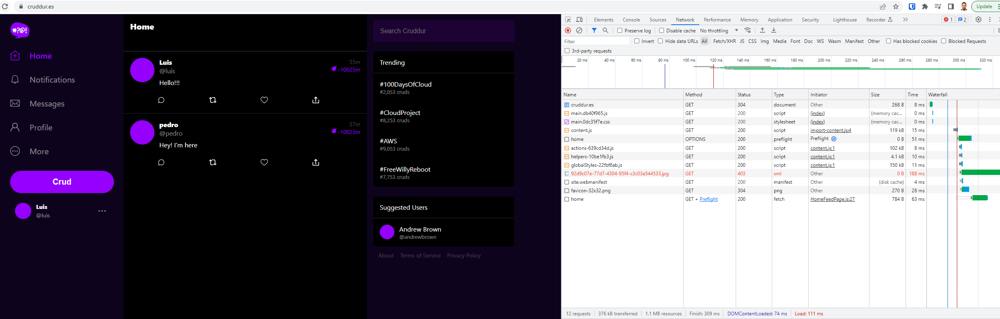
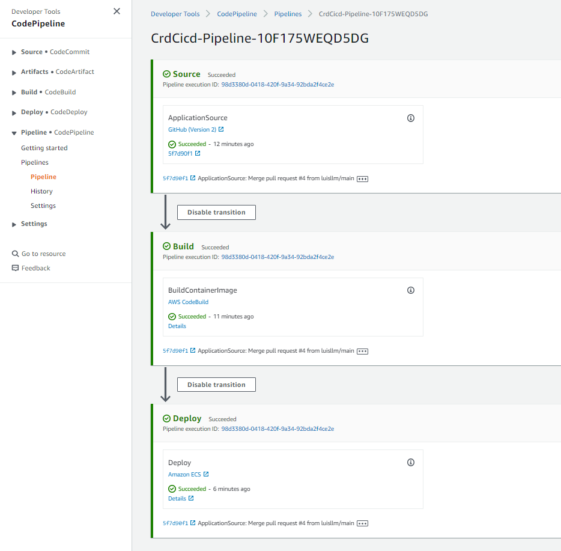
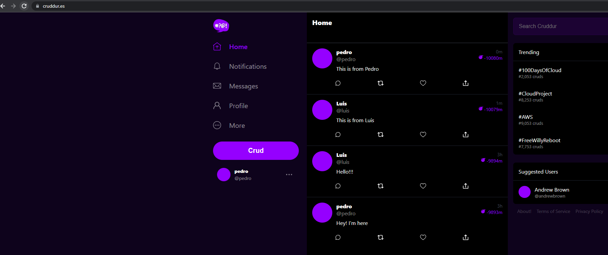
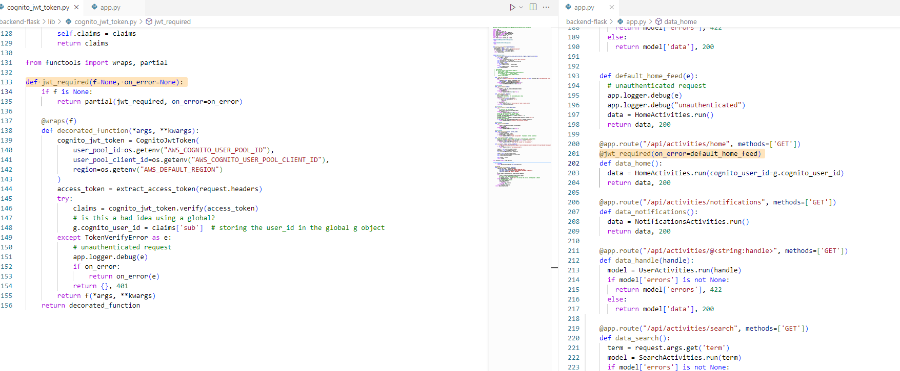
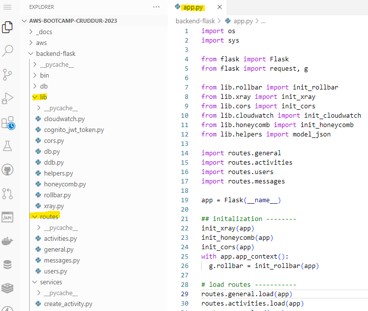

# Week X — Cleanup
## My journal - week X

**Did all the tasks in the weekX to-do list**
-  **WeekX architecture diagram**	


-  **Sync tool for static website hosting**
```
gitpod /workspace/aws-bootcamp-cruddur-2023 (main) $ ./bin/frontend/sync 
== configuration
aws_default_region:   eu-west-1
s3_bucket:            cruddur.es
distribution_id:      E175D38K2F1UD9
build_dir:            /workspace/aws-bootcamp-cruddur-2023/frontend-react-js/build
output_changset_path: /workspace/aws-bootcamp-cruddur-2023/tmp/changeset-1688211187.json
auto_approve:         false
sync ==
I, [2023-07-01T11:33:07.626787 #18088]  INFO -- : Runner.run
I, [2023-07-01T11:33:07.626877 #18088]  INFO -- : List.local
I, [2023-07-01T11:33:07.638877 #18088]  INFO -- : List.remote
I, [2023-07-01T11:33:07.847112 #18088]  INFO -- : Plan.delete
I, [2023-07-01T11:33:07.847285 #18088]  INFO -- : Plan.create_update
---[ Plan ]------------------------------------------------------------
ChangeSet: changeset-1688211187

WebSync will perform the following operations:

        delete static/js/main.dcabc9c5.js
        delete static/js/main.dcabc9c5.js.LICENSE.txt
        delete static/js/main.dcabc9c5.js.map
--------------------------------------------------------------------
ignore: 8   delete: 3   create: 0   update: 0   no_change: 28

Execute the plan? Type: yes or no
> yes
---[ Apply ]------------------------------------------------------------
ChangeSet: changeset-1688211187

WebSync is performing operations:
I, [2023-07-01T11:33:12.574660 #18088]  INFO -- : Apply.delete
        ["static/js/main.dcabc9c5.js", "static/js/main.dcabc9c5.js.LICENSE.txt", "static/js/main.dcabc9c5.js.map"]
I, [2023-07-01T11:33:12.683052 #18088]  INFO -- : Apply.invalidate
Invalidation Paths
["/static/js/main.dcabc9c5.js", "/static/js/main.dcabc9c5.js.LICENSE.txt", "/static/js/main.dcabc9c5.js.map"]
Invalidation IE5GZKNXZGDG3NKJYF71KOKR7G has been created. Please wait about 60 seconds for it to finish.
```

- **Reconnected DB and PostgreSQL Confirmation Lamba**


- **Fixed CORS to use domain name for web-app**


- **Fixed CI/CD pipeline and create activity**	



- **Refactored to use JWT Decorator in Flask App**


- **Refactor App.py and Flask Routes**



Implement Replies for Posts	
Improved Error Handling for the app	
Activities Show Page	
More General Cleanup Part 1 and Part 2	