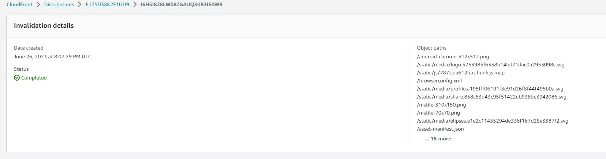

# Week X — Cleanup
## My journal - week X

**Did all the tasks in the weekX to-do list**
-  **WeekX architecture diagram**	

-  **Sync tool for static website hosting**

- **Reconnected DB and PostgreSQL Confirmation Lamba**

- **Fixed CORS to use domain name for web-app**

Ensure CI/CD pipeline works and create activity works	
Refactor to use JWT Decorator in Flask App	
Refactor App.py	
Refactor Flask Routes	
Implement Replies for Posts	
Improved Error Handling for the app	
Activities Show Page	
More General Cleanup Part 1 and Part 2	